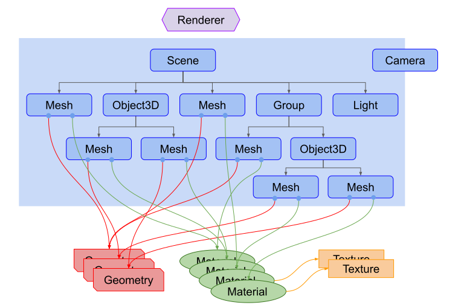

# 创建一个三维正方体场景

官方给出了入门三维图形所需要的部分[基础知识](https://threejsfundamentals.org/threejs/lessons/zh_cn/threejs-fundamentals.html)。这篇主要是做一些补充和说明，帮助用户理解。

首先有几个概念需要仔细观看和阅读，

> 渲染器(Renderer)，场景(Scene)，摄像机(Camera)，渲染器(Renderer)，光源(Light)，网格(Mesh)，材质(Material)，几何体(Geometry)，纹理(Texture)，群组(Group)



上面这张图主要说明路以上几个概念间的关系，先不用着急理解上面，可以先试着运行下面代码，在`demo`文件下有案例

## 创建一个三维场景

```html
<!DOCTYPE html>
<html lang="en">
  <head>
    <title>three.js webgl - convex geometry</title>
    <meta charset="utf-8" />
    <meta name="viewport" content="width=device-width, user-scalable=no, minimum-scale=1.0, maximum-scale=1.0" />
    <link type="text/css" rel="stylesheet" href="main.css" />
  </head>
  <body>
    <div id="info"><a href="https://threejs.org" target="_blank" rel="noopener">three.js</a> - convex geometry</div>

    <script type="module">
      import * as THREE from 'https://cdn.skypack.dev/three'
      import { OrbitControls } from 'https://cdn.skypack.dev/three/examples/jsm/controls/OrbitControls.js'
      import { ConvexGeometry } from 'https://cdn.skypack.dev/three/examples/jsm/geometries/ConvexGeometry.js'
      import { BufferGeometryUtils } from 'https://cdn.skypack.dev/three/examples/jsm/utils/BufferGeometryUtils.js'

      let group, camera, scene, renderer

      init()
      animate()

      function init() {
        /** 创建场景对象Scene */
        scene = new THREE.Scene()
        /** 创建渲染器对象 */
        renderer = new THREE.WebGLRenderer({ antialias: true })
        renderer.setPixelRatio(window.devicePixelRatio) // 设置分辨率倍数（手机和普通显示器像素密度比）
        renderer.setSize(window.innerWidth, window.innerHeight) //设置渲染区域尺寸
        document.body.appendChild(renderer.domElement) // 将渲染器对象添加到body接点

        /** 创建一个相机 */
        camera = new THREE.PerspectiveCamera(40, window.innerWidth / window.innerHeight, 1, 1000) // 分别是视野范围，画布的宽高比，近平面和远平面
        camera.position.set(15, 20, 30) // 设置相机位置
        scene.add(camera) // 相机添加到场景中

        /** 创建一个轨道控制器，用于控制相机 */
        const controls = new OrbitControls(camera, renderer.domElement) // 传入需要相机和渲染对象
        controls.minDistance = 20 // 相机最近距离
        controls.maxDistance = 50 // 相机最远距离
        controls.maxPolarAngle = Math.PI / 2 // 相机最大转角

        // 添加环境光
        scene.add(new THREE.AmbientLight(0x222222))

        // 添加点光源
        camera.add(new THREE.PointLight(0xffffff, 1))

        // 添加坐标辅助线
        scene.add(new THREE.AxesHelper(20))

        // 添加纹理
        const loader = new THREE.TextureLoader()
        const texture = loader.load('textures/disc.png') // 将图片添加到纹理

        // 添加 group 组
        group = new THREE.Group() 
        scene.add(group)

        // 创建一个正6体，长 宽 高都为1

        let boxGeometry = new THREE.BoxGeometry(10, 10, 10)

        // 删除normal 和 uv 数据， 如果没有删除则不能合并定点数据
        boxGeometry.deleteAttribute('normal')
        boxGeometry.deleteAttribute('uv')

        boxGeometry = BufferGeometryUtils.mergeVertices(boxGeometry) //其顶点合并了所有相似的顶点属性

        const vertices = [] // 顶点数组
        const positionAttribute = boxGeometry.getAttribute('position') // 获取顶点数据

        for (let i = 0; i < positionAttribute.count; i++) {
          const vertex = new THREE.Vector3() // 设置三维向量
          vertex.fromBufferAttribute(positionAttribute, i) // 通过positionAttribute设置顶点向量
          vertices.push(vertex) // 顶点数组中添加向量
        }

        // 新建点材质
        const pointsMaterial = new THREE.PointsMaterial({
          color: 0x0080ff, // 颜色
          map: texture, // 纹理
          size: 1,  // 点的大小
          alphaTest: 0.5 //
        })

        const pointsGeometry = new THREE.BufferGeometry().setFromPoints(vertices) // 通过点队列设置该 BufferGeometry 的 attribute

        const points = new THREE.Points(pointsGeometry, pointsMaterial) // 生成蓝色的小点

        group.add(points) // 向group中田间点

        // 设置正方体的材质
        const meshMaterial = new THREE.MeshLambertMaterial({
          color: 0xffffff,
          opacity: 0.5,
          transparent: true
        })

        const meshGeometry = new ConvexGeometry(vertices) // 生成凸包几何体

        // 渲染反面
        const mesh1 = new THREE.Mesh(meshGeometry, meshMaterial)
        mesh1.material.side = THREE.BackSide // back faces
        mesh1.renderOrder = 0
        group.add(mesh1)

        // 渲染反面
        const mesh2 = new THREE.Mesh(meshGeometry, meshMaterial.clone())
        mesh2.material.side = THREE.FrontSide // front faces
        mesh2.renderOrder = 1
        group.add(mesh2)

        // 监听窗口变化
        window.addEventListener('resize', onWindowResize)
      }

      function onWindowResize() {
        camera.aspect = window.innerWidth / window.innerHeight
        camera.updateProjectionMatrix()

        renderer.setSize(window.innerWidth, window.innerHeight)
      }

      function animate() {
        requestAnimationFrame(animate) 

        group.rotation.y += 0.005 // group 的角度改变

        render() // 渲染
      }

      function render() {
        renderer.render(scene, camera)
      }
    </script>
  </body>
</html>
```


上面的代码[来源](https://threejs.org/examples/#webgl_geometry_convex)threejs官网内容，并做了部分修改。


> 大概都做了些什么
>> 引入threejs代码以及相应的库
>> 创建了一个Scene（场景），场景相当于一块画布，用于渲染你所需要渲染的对象
>> 创建了一个Camera（相机），即渲染场景时，视角所在的位置，角度和方向
>> 给相机添加了一个（OrbitControls）轨道控制器，用于控制相机视角，以及围绕中心点旋转视角和距离
>> 添加光源，否则你什么也看不到，作者添加了两个光源，使立体感更好一些
>> 添加一个 group（组），添加BoxGeometry（立方体）并添加到gruop中，获取正方体顶点数据，通过顶点数据添加点，和点材质颜色等。


如果你对上面的代码有一点了解了，接下来就查看每一个概念所相关的参数和用途吧。

