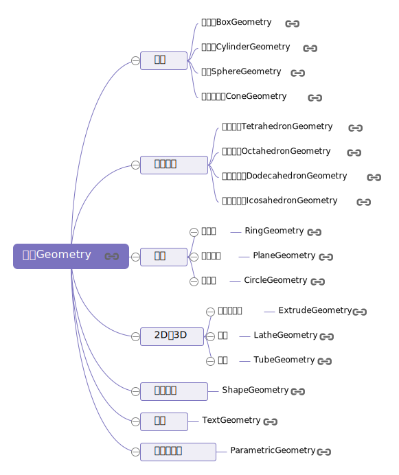
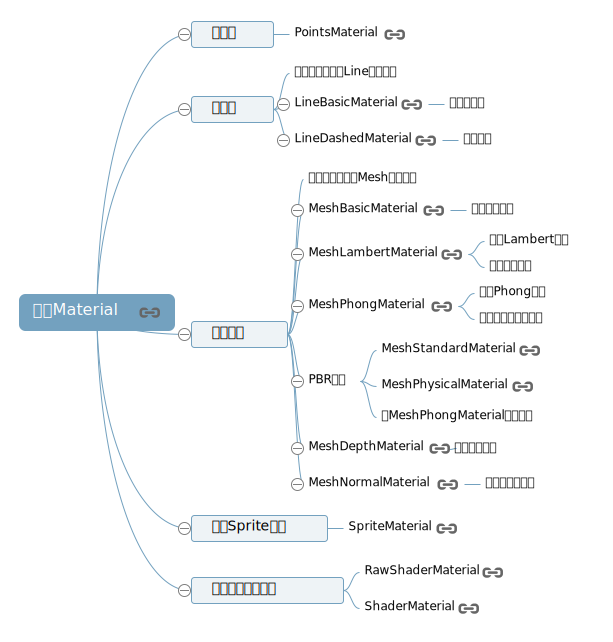

## Scene 场景

最先开始接触的便是场景了，threejs 文档给出的解释是 -- 允许你在什么地方、摆放什么东西来交给 three.js 来渲染，这是你放置物体、灯光和摄像机的地方。

## camera 相机

有了场景，需要一个位置查看整个场景和场景内的物体，这时候就需要设置一个相机，用来看清场景的的一切。后面再讲怎么移动相机，使场景内的物体看起来更像三维物体。

## light 光源

有了光源，才能看见物体和物体反射出来的光

_环境光 AmbientLight_

环境光是没有特定方向的光源，主要是均匀整体改变 Threejs 物体表面的明暗效果，这一点和具有方向的光源不同，比如点光源可以让物体表面不同区域明暗程度不同。

_平行光 DirectionalLight_
平行光是沿着特定方向发射的光。这种光的表现像是无限远,从它发出的光线都是平行的。常常用平行光来模拟太阳光的效果;

_点光源 PointLight_
从一个点向各个方向发射的光源

_聚光源 SpotLight_
聚光灯是从一个方向上的一个点发出，沿着一个圆锥体，它离光越远，它的尺寸就越大。

## 物体

有了光源和环境，需要添加物体，才能看见被看见。

threejs 封装的常见物体有

## 材质

有了光，有了物体，为了让物体看起来更好看或者更真实，向物体添加材质，使其具有光泽。其中 MeshBasicMaterial 网格基础材质没有阴影效果。

或者通过 ImageLoader.load 方法添加图片等设置材质和纹理

