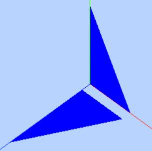

# 顶点位置数据解析渲染

threejs 是 WebGL 的三维引擎，WebGL是一个只能画点、线和三角形的非常底层的系统，所以如果需要画一些其他的图形和画面，需要具备一点 WebGL 的基础知识

在three.js中， BufferGeometry 是用来代表所有几何体的一种方式。BufferGeometry 本质上是一系列 BufferAttributes 的所组成的 名称 。每一个 BufferAttribute 代表一种类型数据的数组：position 位置, normal 法线, color 颜色, uv，

### 自定义几何体

通过下面的代码自定义了一个几何体，通过网格模型可以渲染出来两个三角形效果。



```js 
var geometry = new THREE.BufferGeometry(); //创建一个Buffer类型几何体对象
//类型数组创建顶点数据
var vertices = new Float32Array([
  0, 0, 0, //顶点1坐标
  50, 0, 0, //顶点2坐标
  0, 100, 0, //顶点3坐标
  0, 0, 10, //顶点4坐标
  0, 0, 100, //顶点5坐标
  50, 0, 10, //顶点6坐标
]);
// 创建属性缓冲区对象
var attribue = new THREE.BufferAttribute(vertices, 3); //3个为一组，表示一个顶点的xyz坐标
// 设置几何体attributes属性的位置属性
geometry.attributes.position = attribue;

// 三角面(网格)渲染模式
var material = new THREE.MeshBasicMaterial({
  color: 0x0000ff, //三角面颜色
  side: THREE.DoubleSide //两面可见
}); //材质对象
var mesh = new THREE.Mesh(geometry, material); //网格模型对象Mesh
```